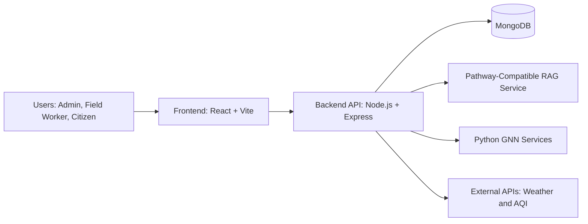
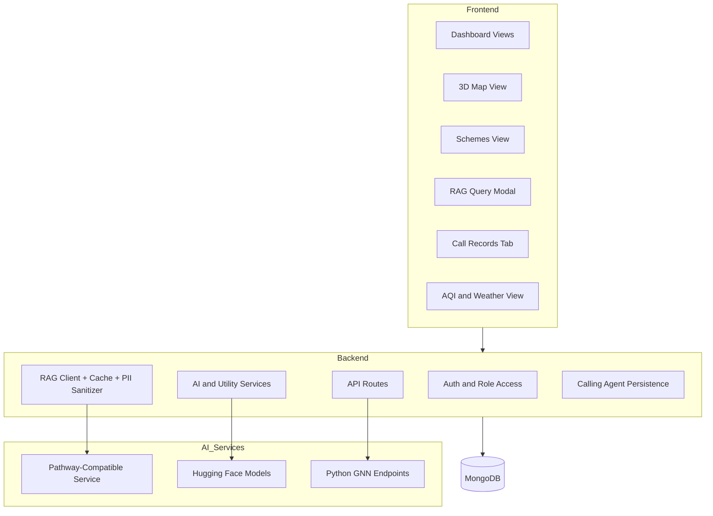
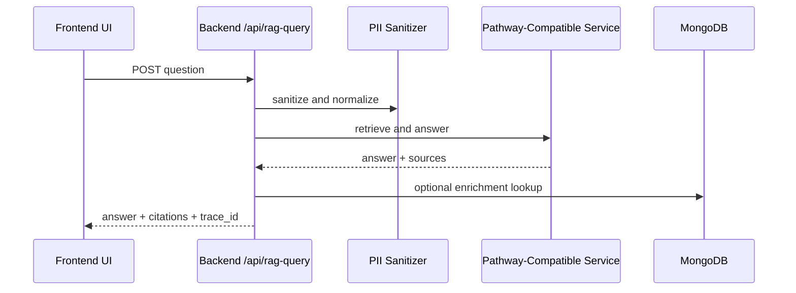
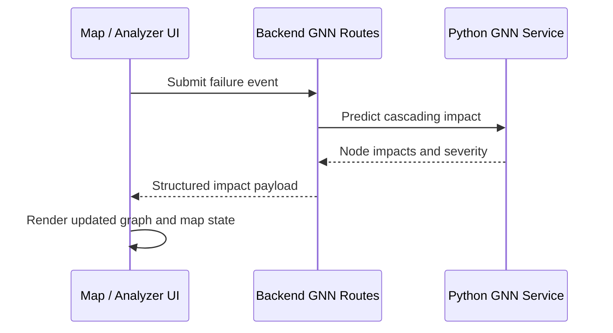

# RuraLens

RuraLens is an AI-enabled village digital twin platform for monitoring public infrastructure, analyzing scheme execution, and improving citizen service delivery.

## Table of Contents

- Overview
- Core Capabilities
- Architecture
- Data and Request Flows
- Technology Stack
- Repository Structure
- Getting Started
- Environment Configuration
- API Overview
- Security and Access Control
- Troubleshooting
- Contributing
- License

## Overview

RuraLens combines operational dashboards with AI services to support administrators, field staff, and citizens.

The platform focuses on:

- Real-time infrastructure visibility
- Scheme progress and discrepancy analysis
- AI-assisted question answering with citations
- Graph-based impact simulation for failure scenarios
- Citizen complaint intake, including voice-driven workflows for low-connectivity areas

## Core Capabilities

### 1. RAG Knowledge Engine

- Natural language querying over schemes, reports, and related documents
- Citation-backed answers
- Caching and rate limiting for stable response behavior
- PII sanitization before model requests

### 2. GNN Impact Forecaster

- Infrastructure represented as connected graph nodes
- Failure simulation and cascading impact estimation
- Impact scoring to prioritize mitigation actions

### 3. Discrepancy Detection

- Cross-checks between planned milestones and submitted progress artifacts
- Highlights timeline drift, budget variance, and evidence mismatches

### 4. Anonymous Issue Reporting

- Citizen-friendly complaint registration with escalation workflow support
- Designed for transparency and traceability in issue lifecycle

### 5. AI Calling Agent (Kavya)

- Voice-based complaint intake for areas with poor internet connectivity
- Registers calls as structured complaint records in the platform workflow

## Architecture

### High-Level System Diagram



### Component View



## Data and Request Flows

### RAG Query Flow



### Failure Impact Flow



## Technology Stack

### Frontend

- React 18 + TypeScript
- Vite
- Tailwind CSS
- MapLibre GL / react-map-gl
- Chart.js / react-chartjs-2
- Zustand

### Backend

- Node.js (>=18)
- Express
- MongoDB + Mongoose
- JWT-based auth
- Axios and utility middleware

### AI and Data Science Layer

- Pathway-compatible RAG service (Dockerized option available)
- Hugging Face inference integrations
- Python GNN services

## Repository Structure

```text
.
├─ backend/
│  ├─ config/
│  ├─ models/
│  ├─ routes/
│  ├─ scripts/
│  ├─ utils/
│  ├─ python-gnn/
│  └─ pathway-rag/
├─ frontend/
│  ├─ src/
│  │  ├─ components/
│  │  ├─ hooks/
│  │  ├─ services/
│  │  └─ store/
│  └─ assets/
├─ schemes/
├─ docker-compose.pathway.yml
└─ README.md
```

## Getting Started

### Prerequisites

- Node.js 18 or later
- npm
- Python 3.11 or later
- MongoDB (local or Atlas)

### Install Dependencies

```bash
# From repository root
npm install

# Backend
cd backend
npm install
```

### Run Frontend

```bash
# From repository root
npm run dev
```

### Run Backend

```bash
# From repository root
cd backend
npm run dev
```

### Optional: Run Pathway-Compatible RAG via Docker

```bash
# From repository root
docker compose --env-file backend/.env -f docker-compose.pathway.yml up -d --build
```

## Environment Configuration

Create `backend/.env` from `backend/.env.example` and configure at minimum:

- `PORT`
- `MONGODB_URI`
- `JWT_SECRET`
- `PATHWAY_MCP_URL`
- `PATHWAY_MCP_TOKEN` (required for authenticated RAG service calls)
- `HUGGINGFACE_API_KEY` (if using HF-backed model calls)

## API Overview

### Core Endpoints

- `POST /api/auth/login`
- `GET /api/schemes`
- `POST /api/rag-query`
- `POST /api/gnn/*` (impact and graph-related routes)
- `GET /api/anonymous-reports/*`
- `GET /health`

### RAG Request Example

```json
{
        "question": "Which schemes are delayed and why?",
        "scheme_id": "sch002",
        "max_citations": 5
}
```

### RAG Response Shape (Simplified)

```json
{
        "answer": "...",
        "citations": [
                {
                        "doc_id": "sch002",
                        "snippet": "...",
                        "score": 0.91
                }
        ],
        "trace_id": "trace_...",
        "cached": false
}
```

## Security and Access Control

- JWT authentication for protected routes
- Role-aware UI and route behavior (admin, field worker, citizen)
- Request sanitization for user-provided prompts
- PII filtering prior to external model calls
- Cache and rate-limit controls on AI query routes

## Troubleshooting

### Backend fails with EADDRINUSE on port 3001

Another process is already bound to port 3001.

On Windows PowerShell:

```powershell
$conn = Get-NetTCPConnection -LocalPort 3001 -State Listen -ErrorAction SilentlyContinue
if ($conn) {
        $conn | Select-Object -ExpandProperty OwningProcess -Unique | ForEach-Object {
                taskkill /PID $_ /F
        }
}
```

Then restart backend:

```bash
cd backend
npm run dev
```

### PATHWAY_MCP_TOKEN not set warning

Set `PATHWAY_MCP_TOKEN` in `backend/.env` to match your RAG service configuration.

## Contributing

1. Create a feature branch.
2. Make focused changes with tests where applicable.
3. Open a pull request with clear scope and validation notes.

## License

This project is licensed under the MIT License.

